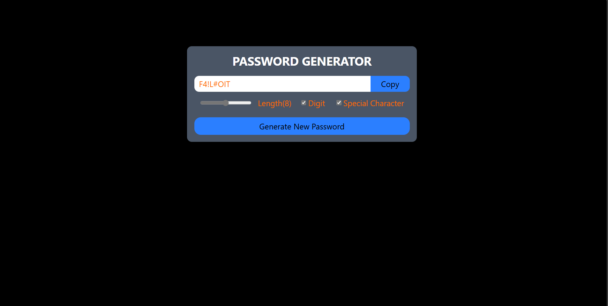

# 🔐 Password Generator

A simple and efficient **Password Generator** built using **React**. This application allows users to generate secure passwords by specifying the desired length and selecting whether to include special characters and numbers.



## ✨ Features
- 🔢 Set the desired length of the password
- 🔠 Option to include special characters (`!@#$%^&*()` etc.)
- 🔢 Option to include numbers (`0-9`)
- 📋 Copy generated password to clipboard
- 🖥️ User-friendly interface

## 📦 Installation

1. Clone the repository:
   ```sh
   git clone https://github.com/Baljender-Singh-Bamrah/password-generator.git
   ```
2. Navigate to the project directory:
   ```sh
   cd password-generator
   ```
3. Install dependencies:
   ```sh
   npm install
   ```
4. Start the development server:
   ```sh
   npm start
   ```

## 🚀 Usage
1. Open the application in your browser.
2. Adjust the password length using the slider or input box.
3. Toggle options to include numbers and special characters.
4. Click **Generate New Password** to create a secure password.
5. 📋 Copy the password to your clipboard with one click.

## 🛠️ Technologies Used
- ⚛️ React.js
- 📜 HTML5
- 🎨 CSS3
- 🟨 JavaScript (ES6+)

## 🤝 Contributing
Contributions are welcome! Feel free to **fork** the repository, create a new branch, and submit a **pull request**.

## 📬 Contact
For any questions or suggestions, feel free to open an issue or reach out via [GitHub](https://github.com/Baljender-Singh-Bamrah/password-generator).

---
**Made with ❤️ using React**

